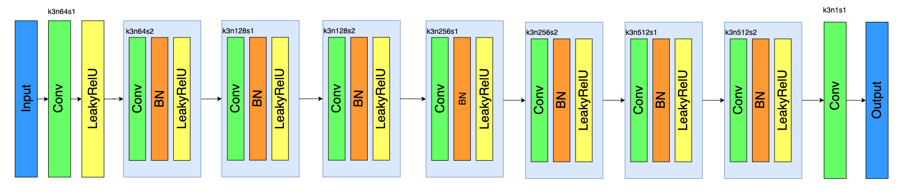
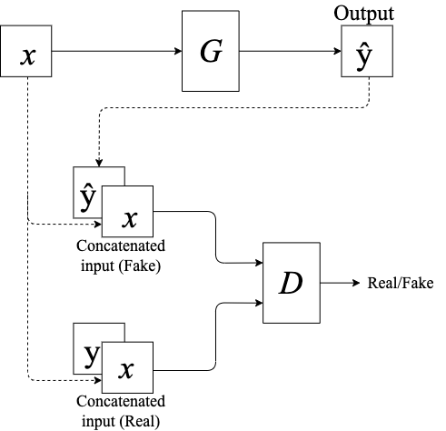
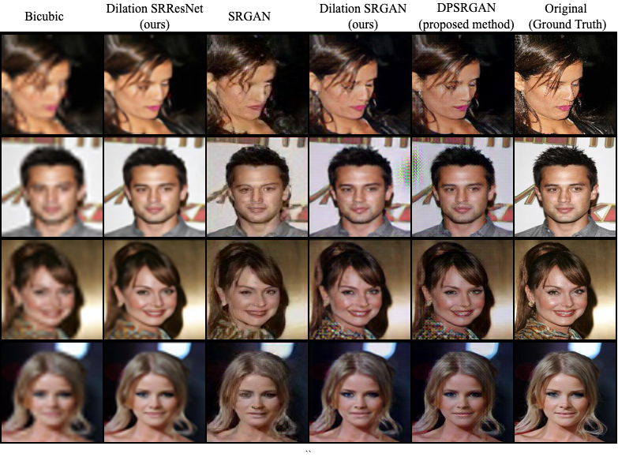

# DPSRGAN: Dilation Patch Super-Resolution Generative Adversarial Networks

A PyTorch implementation of [DPSRGAN: Dilation Patch Super-Resolution Generative Adversarial Networks](https://ieeexplore.ieee.org/document/9417903)

## Usage
### Installation
```bash
git clone https://github.com/kushalchordiya216/Super-Resolution.git
cd Super-Resolution
pip3 install -r requirements.txt
```

### Training
To pretrain the generator before GAN training:
```bash
python3 train.py --data_dir <path to HR images> --network SRResNet
```

For GAN training:
```bash
python3 train.py --data_dir <path to HR images> --network SRGAN --pretrain_gen <path to pretrained generator model file>
```
To view more argument descriptions:
```bash
python3 train.py --help
```

### Testing
This will save the predicted images in the directory `./preds/`
```bash
python3 --model_path <path to pretrained generator> --data_dir <path to directory containing LR images>
```

## Architecture
Generator:

Discriminator:

Training schematic:

## Comparison and Results

## Citation
```
@INPROCEEDINGS{9417903,
    author={Mirchandani, Kapil and Chordiya, Kushal},
    booktitle={2021 6th International Conference for Convergence in Technology (I2CT)},
    title={DPSRGAN: Dilation Patch Super-Resolution Generative Adversarial Networks},
    year={2021},  
    volume={},  
    number={},  
    pages={1-7},  
    doi={10.1109/I2CT51068.2021.9417903}}
```

